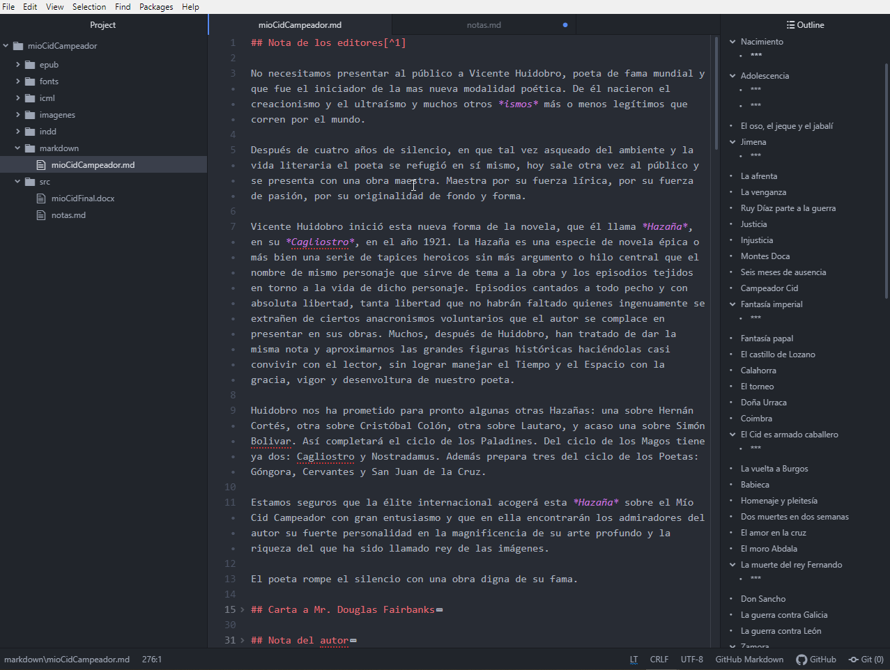

## 1. El problema

Supongamos que hará unos diez años editamos y publicamos un libro, que ahora necesitamos reeditar. Los archivos siguen almacenados en un disco duro, de modo que bastaría recuperarlos, abrirlos en InDesign, hacer las correcciones y ajustes que hagan falta, y volver a imprimir.

En el disco duro encontramos la carpeta con el proyecto y dentro de esta carpeta, una subcarpeta llamada "tripa" donde efectivamente hay un archivo InDesign. Perfecto. El problema es que mi versión de InDesign decide que no es un archivo con quién quiera tener algún tipo de trato.


El mensaje no solo es desalentador, también es totalmente opaco. ¿Por qué no se puede abrir? ¿El archivo está corrupto? ¿Tiene que ver con la versión de InDesign que estoy usando? Ninguna pista. Podría probar utilizando la versión de InDesign con la que cree el archivo, pero, demonios, hace diez años de eso, ¿cuál podría haber sido? Sin contar con que tendría que descargarla e instalarla y sin ninguna garantía de que el asunto funcionase.

Vamos, pues, al plan B. Que no es otro que localizar la última versión del manuscrito en MS en Word y rehacer la maqueta.

El manuscrito en cuestión se produjo después de un laborioso escaneo: nada extraño considerando que la última edición del libro en cuestión era de hace unos treinta o cuarenta años atrás. Cualquiera que halla escaneado un libro sabe que los resultados distan mucho de definir la palabra prolijidad. El resultado: la corrección tomó un  tiempo, primero utilizando herramientas automatizadas (grep, fundamentalmente, pero ya hablaremos de eso), y un trabajo denodado de nuestro corrector. Por tanto, el ir y venir de borradores por correo electrónico fue profuso.

Considerando lo anterior, resulta natural (preocupante, pero natural) que cuando miramos en la carpeta que contiene los borradores, encontremos no uno sino una serie de archivos (versión2, versiónfinal, versión definitiva... espera, ¿"versiondefinitiva" es más final que "final" ¿o es al revés?). Siempre podemos buscar sencillamente la última versión del documento en MS Word y trabajar con esa. Pero, ¿es realmente la última o la corrección final fue hecha en InDesign? De ser así, posiblemente podríamos recuperar el log del control de cambios en InDesign... solo que no podemos. ¿O tal vez la revisión más reciente incluía cosas que descartamos en la versión final del libro? Es una posibilidad. De paso y ya que estamos, convendría también revisar los correos electrónicos con el corrector.


Al final escogemos un archivo, y lo abrimos. Naturalmente, los encabezados brillan por su ausencia y después de echar un vistazo en el panel de estilos, sabemos que mapear esto e importarlo de alguna manera indolora en InDesign va a ser la más utópica de las proezas.

Llegado a este punto, habrán pasado un par de horas y estaremos sentados frente al ordenador con deseos de tirarlo por la ventana y correr a ahogarnos de chupitos en algún antro infame.


### 1.1

Cosas como estas pasan todo el tiempo. Sean estos los problemas, u otros distintos, o una combinación variable de problemas conocidos y otros totalmente novedosos, la combinación MS Word + InDesign rara vez es indolora, sobre todo si consideramos documentos enviados por correctores o traductores o escritores: pueden lucir muy bien, pero rara vez están bien estructurados. Y la tentación del diseño (que es una especie de enfermedad que se apodera tarde o temprano de los usuarios de Word) termina por crear monstruos, para mayor horror de diseñadores y editores. Discutiremos esto en otro lugar, pero sí podemos mencionar rápidamente los problemas de MS Word:

- Nada sostenible (abrir un documento de una versión antigua de word y esperar que todo funcione es una operación que involucra una dosis importante de azar)
- El código que genera es confuso y pesado
- Su sistema de control de versiones es limitado (en funcionalidad y alcance)

Y sin embargo, word es el estándar, lo cual no deja de resultar misterioso. ¿No hay otra manera de hacer las cosas? En efecto la hay. Pero aunque es más eficiente y fluida y nos abre numerosas posibilidades, por alguna razón nadie o casi nadie la utiliza. Ese es el camino que vamos a explorar. Lo que voy a proponer aquí es un flujo de trabajo digital, open source y sostenible, que en mi opinión resuelve muchos de los problemas del workflow tradicional, cuyo principal defecto es que está orientado primariamente a la producción de un material impreso en un entorno digital. Con esto, desde luego, no quiero insinuar que tengo algo en contra del libro impreso, sino más bien que es posible _también_ hacer libros impresos bellamente formateados partiendo de un concepto de producción puramente digital.


## 2. Objetivo, herramientas & requisitos

### Objetivo

El propósito de este tutorial será mostrar desde un punto de vista práctico  como combinar herramientas para crear un libro multiformato, de una mera sostenible y automatizada, y que, de paso, resuelve punto por punto nuestro problema..

Este es únicamente un posible *workflow* y desde luego que existen muchas otras herramientas y combinaciones. El punto que espero demostrar es únicamente la cantidad de herramientas que existen a nuestra disposición, que pueden transformar el proceso de producción de un libro hasta el punto de permitirnos automatizar todas las tareas, ganando en eficiencia y al mismo tiempo en control sobre nuestros proyectos.

Para mostrar esto, voy a replantear mi proyecto (la edición de *Mío cid campeador* de Vicente Huidobro) y rehacerlo desde el principio. Para ello:

- Crearemos, a partir de los archivos que tenemos, un set de archivos fuente en markDown (texto plano con la extensión ``.md``)
- Luego crearemos un repositorio para albergar los archivos necesarios
- Crearemos un archivo formateado en ``yaml`` para almacenar la metadata del libro
- Pondremos este repositorio (el directorio donde vive nuestro proyecto) bajo control de versiones con ``git``
- Sincronizaremos este repositorio local con un repositorio remoto en GitHub
- Utilizando pandoc, crearemos nuestro Epub, y crearemos un archivo ICML para importarlo en inDesign
- Crearemos desde InDesign el PDF final de imprenta
- Veremos como hacer correcciones, manteniendo un único set de archivos fuente y guardando un registro histórico de correcciones.
- y por último, crearemos una página web con los archivos de nuestro libro.


### 2.1 Requisitos

Para seguir este tutorial, es aconsejable (aunque no indispensable):

- Alguna familiaridad con la línea de comandos.
- Tener conocimientos básicos de HTML y CSS.
- Un conocimientos de InDesign a nivel de diseño editorial.
- Una mente abierta (todo lo anterior se puede reemplazar con una aplicada búsqueda en Google, esto último no).

### 2.3 Herramientas & software

Y deberemos tener instalado en nuestro PC:

- Un editor de texto plano (no procesador de texto): yo utilizaré Atom, pero hay una serie de editores de texto igualmente útiles y libres (Visual Studio Code, Sublime Text, Vim, etc...)
- Línea de comandos (en Windows, el PowerShell; en Linux, el terminal o uno cualquiera de sus emuladores; en Mac, la terminal).
- Pandoc
- InDesign
- Git y el cliente de escritorio de GitHub
- MS Word
- Jeckyll

Instalar software es tedioso. De momento, vamos a sumir que (como yo) tenéis todo el software instalado en vuestro ordenador.

Y dado que de lo que se trata es de probar algo distinto (no se puede esperar un resultado diferente si hacemos lo mismo), vamos a cambiar nuestro enfoque y utilizar Markdown como formato base, en lugar del consabido MS Word.  Las razones para escoger markdown son exactamente las mismas que para desechar MS Word y se pueden resumir en los tres mantras de cualquier workflow editorial en un entorno digital:

- estructura
- sostenibilidad
- interoperatividad

Necesitamos un archivo bien estructurado. Esto garantiza que pueda ser mapeado correctamente para la importación en InDesign, que se pueda generar un epub automáticamente, y que este epub, tal cual ha sido exportado por pandoc, sea accesible.

El hecho de que trabajemos en texto plano (markdown más que un formato, es una convención para etiquetar texto plano), garantiza que estos archivos sean legibles por cualquier ordenador, sea cual sea el sistema operativo y el software que tengan instalado, ahora, hace treinta años o en el siglo XXII. Además, son tan interpretables por máquinas como legibles por humanos, y pesan ridículamente poco comparados con sus colegas con ínfulas, los procesadores de texto

Y por estas razones, son también fácilmente trasladables (de una maquina a otra, de un software a otro, de un lenguaje de etiquetado a otro). Si el archivo está bien estructurado, podemos hacer en efecto lo que queramos con él.

manos a la obra.


##  Configurar el espacio de trabajo

### El espacio de trabajo

Lo primero será crear el directorio donde van a vivir los archivos de mi proyecto. En mi ordenador será la carpeta ``mioCidCampeador``. Dentro de esta carpeta, además crearé una carpeta para las imágenes, otra para los archivos markdown y una última que llamaré ``src`` (por "source": el archivo fuente o archivo base). para ello, nos situamos con el terminal en el directorio donde queremos crear la carpeta de nuestro proyecto), y escribimos:

````
mkdir mioCidCampeador
cd mioCidCampeador
mkdir imagenes, markdown, src
````

Naturalmente, también se puede crear la carpeta haciendo ``click derecho > crear carpeta``, pero para los propósitos de este tutorial, utilizaremos la línea de comandos: es más rápido y de esta manera nos familiarizamos con su uso.

Una vez creada nuestra carpeta, podemos poner nuestro documento (si: mioCidFinal.docx) en la carpeta correspondiente y abrimos el directorio de nuestro proyecto con nuestro editor de texto:



y navegamos con el terminal a la carpeta ``src``, donde tenemos el archivo ``mioCidFinal.docx``

## Formatear

### Markdown

De momento tenemos una carpeta, una serie de subcarpetas, y un único archivo. Pero, ¿no íbamos a partir desde markdown? En efecto. Por tanto, lo primero que haremos será convertir el documento base (mioCidFinal.docx) a markdown. Y aquí es dónde entra Pandoc.

Pandoc es un software de linea de comandos (CLI), creado y mantenido por John MacFarlane, profesor de Filosofía en la Universidad de California en Berkeley. Muy brevemente, se puede describir como un conversor universal de formatos de texto. Pero es mucho más. Y puesto que fue concebido por un académico y con el objetivo de servir de herramientas a académicos, cuenta entre sus virtudes la capacidad de manejar metadata, referencias bibliograficas y sistemas de citación que mejoran casi cualquier herramienta dedicada a estas tareas. hablaremos más adelante más en detalles de qué hace y cómo lo hace, de momento (y como demostración de lo que es capaz), vamos a navegar a la carpeta ``src``, que contiene el documento ``mioCidFinal.docx`` y vamos a abrir la línea de comandos ahí. En Windows, sencillamente hay que abrir la carpeta correspondiente y hacer click en Archivo > abrir Windows Power Shell:


y cuando se abra el Power Shell, vamos a escribir:

````
 pandoc mioCidFinal.docx -f docx+empty_paragraphs -t markdown  --wrap=none --atx  -o mioCidCampeador.md
````

Si ahora miramos de nuevo en la carpeta, veremos que un nuevo archivo (``mioCidCampeador.md``) ha aparecido en ella.

¿Qué hemos hecho? Paso por paso, es lo siguiente:

- hemos invocado el programa que vamos a utilizar (``pandoc``)
- le hemos dicho a qué archivo tiene que aplicar las opciones que vamos a definir (``mioCidFinal.docx``)
- le hemos dicho desde qué formato tiene que partir y cómo tratarlo: ``-f``, de *from*, desde, en inglés; ``docx``, es el formato de partida; la opción ``empty_paragraphs`` le dice a Pandoc que queremos que limpie el archivo de todas las líneas vacías.  Pandoc va a preservar todos los estilos predeterminados (encabezados) y estilos locales (itálicas y negritas), traduciéndolos a etiquetas en markdown, pero va a ignorar todos los estilos personalizados que hubiéramos podido definir en el documento (en caso de que quisieramos conservar los estilos personalizados de word, hay una opción: ``+styles``).
- le hemos dicho a qué formato tiene que convertir el documento: ``-t markdown``, a markdown.
- Le hemos dicho que elimine el ajuste de línea (word wrap) o saltos de línea no semánticos: ``wrap=none``
- Que uniforme los encabezados (markdown tiene dos maneras de etiquetar encabezados, atx o setext-style headers): ``--atx``
- y que con toda esta información, cree un archivo llamado ``mioCidCampeador.md``

Pandoc ha hecho todo eso en un par de segundos.
